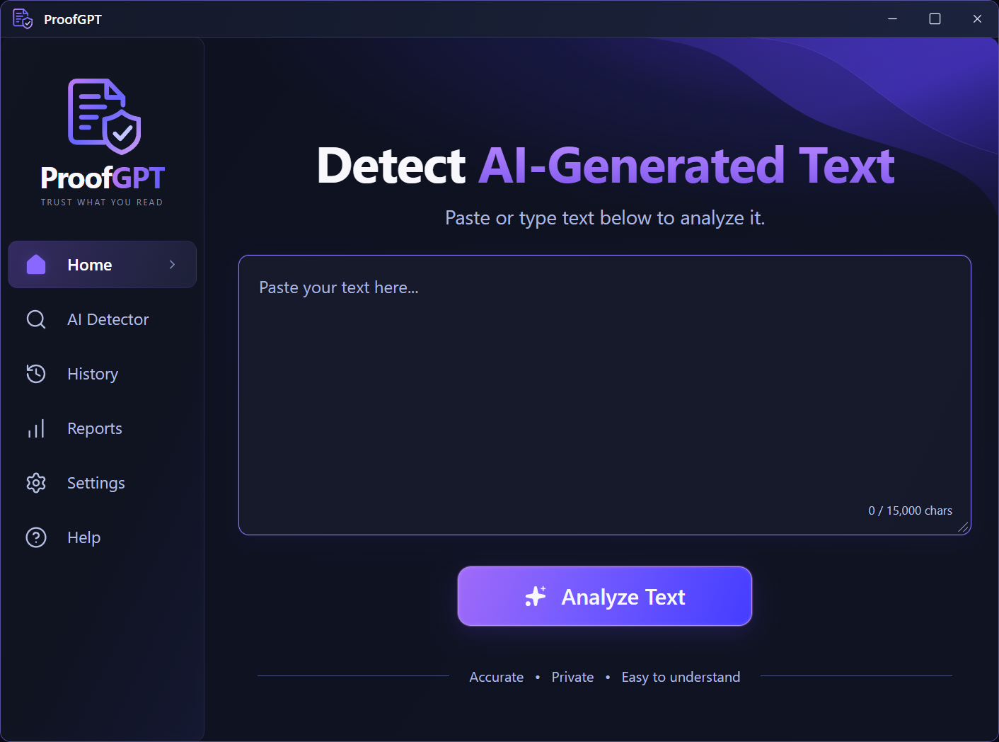
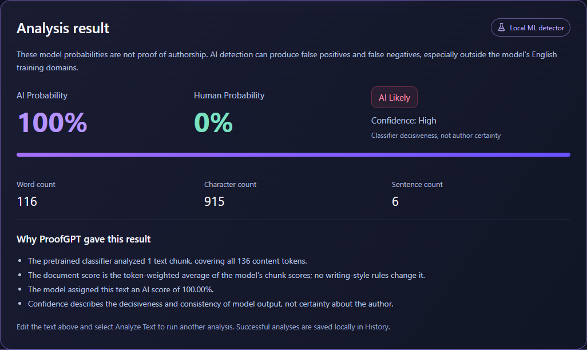
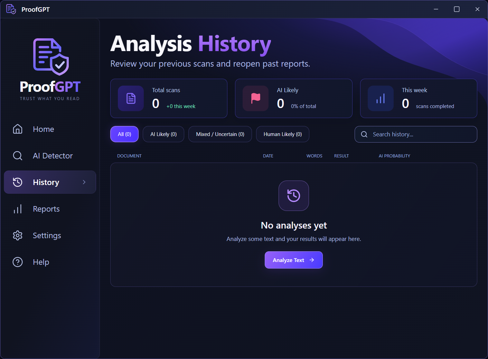
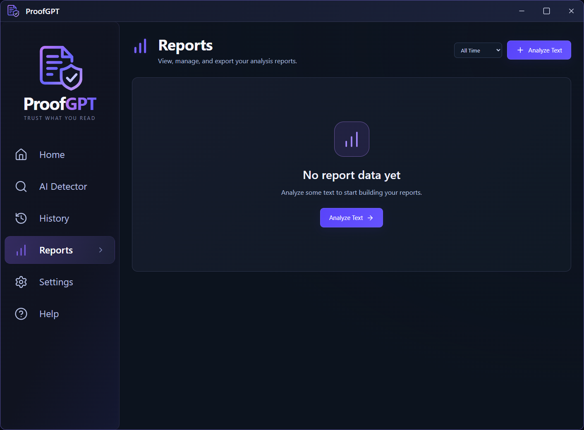
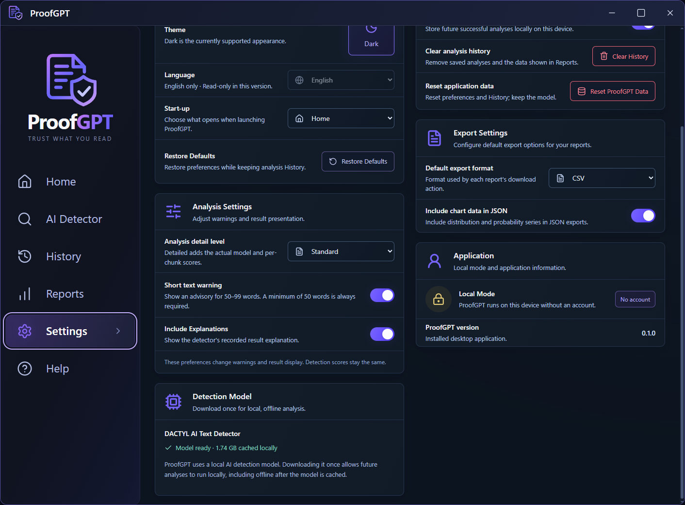

# ProofGPT

ProofGPT is a Windows desktop application that estimates whether text resembles AI-generated or human-written content using a local machine-learning detector. Results are probabilistic indicators, not proof of authorship.

## Screenshots

These are captures of the running application from isolated test profiles. History and Reports show empty states; the analysis result uses a synthetic regression sample and is not an accuracy claim.



<details>
<summary>Analysis result, History, Reports and Settings</summary>

**Analysis result — synthetic test sample**



**History — no saved analyses**



**Reports — no saved analyses**



**Settings — local detection model ready**



</details>

See [screenshot guidance](docs/screenshots/README.md) when replacing or adding captures.

## Features

- Windows desktop application with Home, AI Detector, History, Reports, Settings and Help.
- Local DACTYL / DeBERTa-based inference with AI/Human probability estimates, confidence and recorded explanations.
- Long-text chunking that covers every content token and aggregates chunk predictions.
- Editable text with a live character counter, a 15,000-character limit and a minimum of 50 words.
- Local analysis history with search, filters, saved details and confirmed deletion.
- Reports dashboard derived from saved analyses, with charts, filtering and CSV/JSON exports.
- Persistent settings for startup page, history saving, warnings, result details and export defaults.
- Searchable Help articles and FAQs.
- First-use model download, live downloaded size/percentage/speed, retry/resume and optional download ahead of time from Settings.
- Verified offline inference after the complete model is cached.

## How It Works

Electron runs the desktop window and a React/TypeScript renderer. A restricted preload bridge sends requests to Electron's main process, which communicates with a bundled local detector through structured JSON on stdin/stdout.

The detector uses PyTorch and Hugging Face Transformers to tokenize submitted text and run a pretrained classifier. Documents exceeding its 512-token context are split into model-sized chunks without dropping the remaining text. ProofGPT combines the chunk predictions using a token-weighted average.

Home and Settings share one model manager, detector process and download. An analysis requested during a download waits and continues automatically. See [architecture](docs/ARCHITECTURE.md) for implementation details.

## AI Detector

The exact model is [`ShantanuT01/dactyl-ai-text-detector`](https://huggingface.co/ShantanuT01/dactyl-ai-text-detector), pinned to revision `b62b403cb6c5c14751b5b98b474e5f662b41cef9`. It is a pretrained classifier based on `microsoft/deberta-v3-large`; ProofGPT does not train or alter its weights.

A model probability or High confidence label does not establish who wrote a document. False positives and false negatives can occur. **Do not use ProofGPT results as the sole evidence of academic misconduct or other wrongdoing.** See [model integration notes](detector/MODEL_NOTES.md) for label mapping, chunking, aggregation and confidence limitations.

## Privacy

- Inference runs locally after the model is downloaded. Submitted text is not sent to an external AI API or included in model-download requests.
- Hugging Face is contacted when required model files need downloading. Production disables implicit Hugging Face credentials and telemetry.
- Successful analyses, including original text, are saved locally when history saving is enabled. You can disable saving in Settings or delete saved analyses.
- Default Windows storage is `%APPDATA%\ProofGPT\`: `history.json`, `settings.json` and `model-cache\hub\`. A custom user-data profile changes these locations.
- History and exported reports are not encrypted by ProofGPT. Uninstall preserves local application data; reset/clear operations keep model files and previously exported files.

## First-Time Setup

Install the Windows x64 installer and launch ProofGPT. **Installed users do not need Python, pip, PyTorch or Transformers separately:** the packaged application includes its detector runtime.

Enter at least 50 words and click **Analyze Text**, or use **Settings → Detection Model → Download Model** before analyzing. The first download requires approximately **1.74 GB**, internet access and several GB of free disk space. The app displays downloaded/total size, percentage and actual speed as text. Valid partial Hugging Face downloads can resume through **Retry Download**.

After download, the model is cached locally. Restart detects the complete local cache without a network request. Cached offline inference has been verified in both packaged and installed builds with system Python commands unavailable. CPU inference and long documents can take time.

The current installer is unsigned. Windows may show a publisher or SmartScreen warning. See [Windows usage and recovery](docs/WINDOWS.md).

## Development Setup

Development and rebuilding the detector require Windows x64, Node.js **24+** (or **22.13+**), npm **10+**, and **64-bit Python 3.11 or 3.12**. The detector uses pinned dependencies and CPU-only PyTorch; PyInstaller packaging requirements are in `detector/build-requirements.txt`.

From the repository root in PowerShell:

```powershell
npm ci
py -3.12 -m venv .venv
.\.venv\Scripts\python.exe -m pip install --index-url https://download.pytorch.org/whl/cpu torch==2.6.0
.\.venv\Scripts\python.exe -m pip install -r detector/requirements.txt
.\.venv\Scripts\python.exe -m pip check
```

Use `py -3.11` or the path to a compatible interpreter if needed. Developer Python discovery validates the interpreter version, architecture and dependency imports, then launches that same executable. `PROOFGPT_PYTHON` may select an existing prepared developer environment.

Development caches models in `.model-cache/` by default; developer Hugging Face cache overrides are supported. No Hugging Face token is required for this public model. Keep credentials and machine-specific configuration out of source control.

## Running in Development

After development setup:

```powershell
npm run dev
```

This starts Vite and Electron. Restart Electron after changing main-process or preload code.

To run the built renderer from the source checkout:

```powershell
npm run build
npm start
```

`Start ProofGPT.cmd` provides the source-checkout launch helper. Installed builds launch their bundled detector directly and do not discover or fall back to system Python.

## Building the Detector

```powershell
npm run build:detector
```

This validates the prepared Python environment and CPU-only dependencies, installs the pinned PyInstaller tools, builds `detector/proofgpt-detector.spec`, and verifies the generated runtime with Python unavailable on PATH.

Output: `detector/dist/proofgpt-detector/ProofGPTDetector.exe` and its `_internal/` runtime libraries. This generated output is excluded from Git. It contains the Python runtime and CPU libraries, not the downloaded model weights.

Python is needed by developers rebuilding this executable, not by normal installed users.

## Building ProofGPT for Windows

```powershell
npm run dist:win
```

The command builds/verifies the detector, builds the React renderer and packages the Windows x64 NSIS installer. It does not publish automatically.

Outputs are under `release/`:

- `ProofGPT-Setup-<package-version>-x64.exe`
- `win-unpacked/ProofGPT.exe`
- `win-unpacked/resources/detector-runtime/ProofGPTDetector.exe`

`npm run pack:win` produces an unpacked Windows build. Version and product name come from `package.json`. The approved PNG/ICO assets in `build/icons/` supply the application, executable and installer icons.

### Verification

```powershell
npm test
npm run check:package
npm run test:release
npm run test:model-download
```

Run package checks after creating a Windows build. Source tests cover build/type checking, lint, detector behavior and the six pages. Release/download tests use isolated profiles and real inference; a fresh model download requires internet, time and disk space. Outputs stay in ignored `artifacts/`. See [QA](docs/QA.md) for the verification boundaries and retained regression fixtures.

## Tech Stack

Electron, React, TypeScript, Tailwind CSS, Lucide React, Vite, Python, CPU PyTorch, Hugging Face Transformers/Hub, DACTYL / DeBERTa-v3, PyInstaller, electron-builder and Playwright.

## Project Structure

```text
electron/              Main process, preload, persistence and detector/model managers
src/components/        Reusable renderer components
src/pages/             Home, History, Reports, Settings and Help
src/contexts/          Shared settings and model-download state
src/services/          Renderer services and formatting
src/types/             TypeScript data contracts
shared/                Model metadata and default settings
detector/              Python source, build spec, hook and regression fixtures
scripts/               Development, packaging and verification tools
build/icons/           Approved source PNG/ICO assets
docs/                  Architecture, model notes, Windows guide and screenshots
```

The source repository excludes dependencies, generated executables/installers, virtual environments, model caches, downloaded weights, logs and local user data.

## Limitations

- Detection is probabilistic. False positives/negatives, domain shifts, writing style and the source language model affect results.
- Rounded 0%/100% values and confidence describe classifier output, not verified authorship. The small regression set is not an accuracy benchmark.
- The current model and interface target English; only the Dark theme is implemented.
- First-time setup requires a large download, storage and several GB of RAM. CPU inference may be slow.
- Windows x64 is the supported packaged platform. macOS/Linux installers are not provided.
- The installer is unsigned. Verification has used Windows test profiles, not a fresh VM across every Windows version.
- PDF export, accounts, subscriptions, cloud sync, automatic updates and sentence highlighting are not implemented.

## License

A license for ProofGPT's own source code has not yet been selected. No project `LICENSE` has been added without the owner's approval; public availability alone is not a general reuse grant.

Third-party software, model weights and test excerpts retain their own terms. The official DACTYL and DeBERTa model cards identify MIT licensing. See [third-party attribution](THIRD_PARTY_NOTICES.md) for upstream sources, the retained DACTYL copyright/license notice and fixture provenance. Model weights are downloaded separately and are not committed to this repository.
